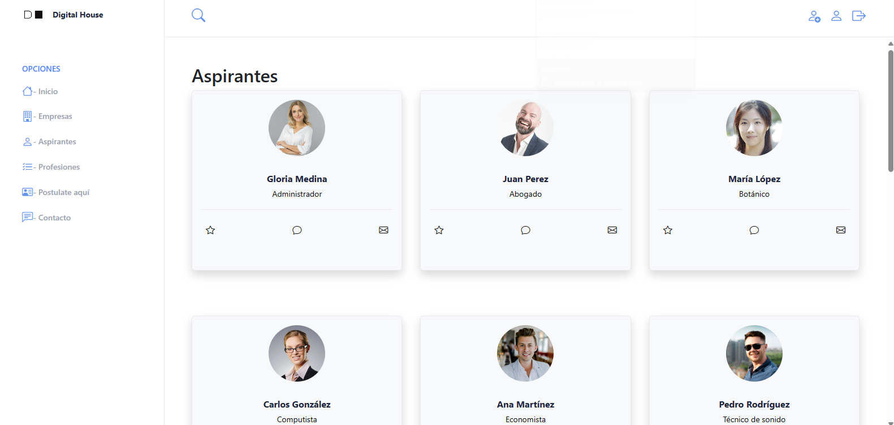

<h1 style="text-align:center">Challenge Recruiting DH</h1>

   
Este es un challenge propuesto por Digital House de Prácticas Profesionales.

   
Se trata de un dashboard hecho en react donde distintos aspirantes puedan publicar su perfil como professinal en
      las diferentes profesiones y datos de contacto. Con empresas ya asociadas en busca de determinados perfiles.
      Visibilidad para cualquier que entre al sitio web y pueda postularse con la posibilidad de obtener el trabajo de
      sus sueños.

   
   

   <h2>Tecnologías</h2>
   

      
      
      
      
      
      
      
   

    
   
Utilización de Nodejs para el backend y react para el frontend. Con base de datos en mysql.

    

<h2>Instalación</h2>
<ol>
    <li>Ejecutar en consola la instalación de paquetes (npm install) tanto en el directorio del frontend como del
        backend</li>
    <li>Crear el archivo environment (.env) y definir las contantes locales tomando de ejemplo el example.env que se
        encuentra en "/backend/src/"</li>
    <li>Irse al directorio del frontend y correr el proyecto en consola (npm run dev)</li>
</ol>

<h2>Documentación</h2>
<h3>Frontend</h3>
<ul>
    <li></li>
    <li></li>
    <li>
        Utilización de la libreria <a href="https://react-hook-form.com/get-started">Reack Hook Form</a> para
        formularios de registro y sus validaciones
    </li>
</ul>

<h3>backend</h3>
<ul>
    <li>Scripts sql de la creación e inserción de datos de la database en la ruta "/Backend/sql"</li>
    <li>CRUD con apis tanto para applicants, companies y proffesions</li>
    <li>Middlewares de multer (subida de imagenes) y express validator (validaciones)</li>
    <li>Modelos hechos para cada tabla de la base de datos</li>
</ul>

<h2>Equipo</h2>
<h3>Mamaní Luis Carlos Manuel. Github: <a href="https://github.com/LuisMPlus">LuisMPlus</a></h3>

<h2>Conclusión</h2>

Enfoque en adquirir prácticas profesionales en la programación de Javascript.

